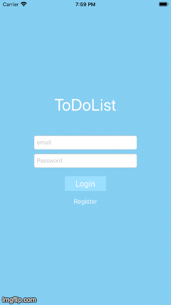

# FirebaseDemo
Firebase simple project. Setup the ToDo app




### Usage:
 `MVC`
 `Firebase Database`
 `Firebase Email Auth`
 `Cocoapods`
 `TableView`
 `Observer`
 `AlerController`

 
### Features: 
Add, create user in Firebase DB
Check and inform in case of bad email input
Keyboard appearence will not overlap the login screen
ToDo list has completed/incompleted options
Add and delete tasks

```swift
MultiLineChartView()
```
